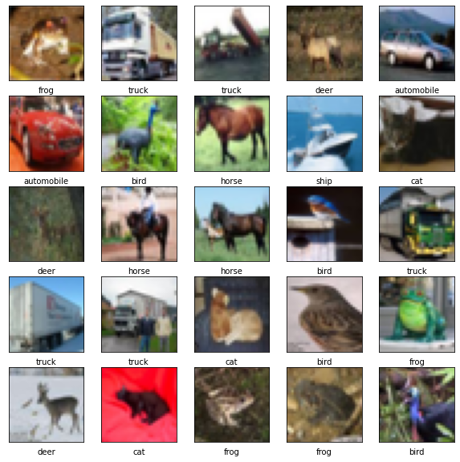
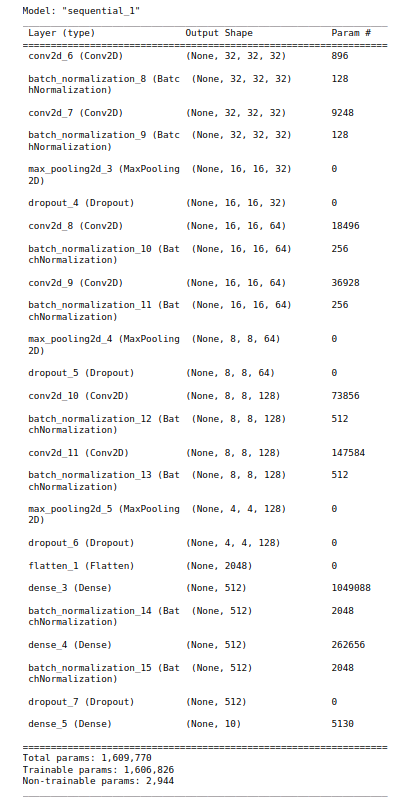

# Data-Augmentation_Regularization-on-CNN :
### Applying **Data Augmentation** and **Regularization** techniques on CIFAR-10 Dataset to improve performance of Convolutional Neural Network

### CIFAR-10
The CIFAR-10 dataset consists of 60000 32x32 colour images in 10 classes, with 6000 images per class. There are 50000 training images and 10000 test images. The 10 classes are airplane, automobile, bird, cat, deer, dog, frog, horse, ship, truck.

The dataset is divided into five training batches and one test batch, each with 10000 images. The test batch contains exactly 1000 randomly-selected images from each class. The training batches contain the remaining images in random order, but some training batches may contain more images from one class than another. Between them, the training batches contain exactly 5000 images from each class.

### Convolutional Neural Network :
A Convolutional Neural Network (ConvNet/CNN) is a Deep Learning algorithm which can take in an input image, assign importance (learnable weights and biases) to various aspects/objects in the image and be able to differentiate one from the other. 

### Model Summary :

### Accuracy with Data Augmentation :

### Data Augmentation :

Synthetically generating similar image data to generalize the model.
### Accuracy with Data Augmentation :

