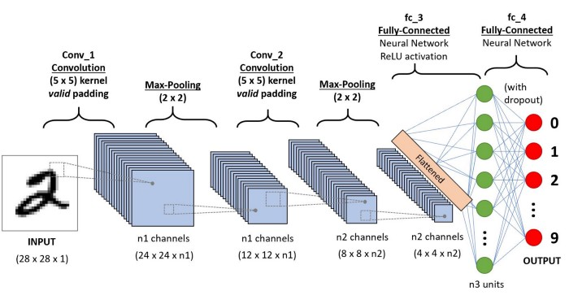
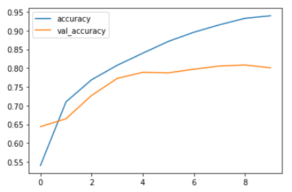
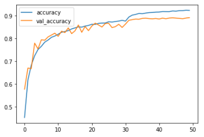

# Data-Augmentation_Regularization-on-CNN :
### Applying **Data Augmentation** and **Regularization** techniques on CIFAR-10 Dataset to improve performance of Convolutional Neural Network

---

### CIFAR-10
The CIFAR-10 dataset contains 60000 32x32 color images in 10 classes. There are 5000 training images and 1000 test images. The 10 classes of animals are airplane, automobile, bird, cat, deer, dog, frog, horse, ship, and truck.

The dataset is divided into five training sets and one test set, each with 10000 images. The test batch includes 1000 images from each of the classes. Some batches of training data may have more images from a certain class than others. Each batch of training data contains 5000 images from each class.

---

### Convolutional Neural Network :
A Convolutional Neural Network (ConvNet/CNN) is a powerful deep learning algorithm that can learn to identify important features in images and make accurate predictions.

A CNN architecture consists of 3 types of layers :

- **Convolution Layer** : This layer extracts specific features from the input image. The convolution mathematical operation is done between the input image and a filter of a specific size MxM.

- **Pooling Layer** : The Pooling layer is responsible for the reduction of size of the Colvolved feature.

- **Fully connected Layer** : This algorithm uses the output of the convolution process to predict the image's class.
---

### Model Summary :

---

### Dropout Regularization :
Dropouts prevent overfitting by randomly turning off some output units. In the above process,  some units in the layer are randomly muted at each iteration. This simplifies the overall structure of the neural network by reducing the number of neurons operating in the forward process. At the same time, the trained model becomes more robust and all other neurons need to learn during training because the model becomes independent of a particular neuron.

In Tensorflow, it is implemented using the following API.

`tf.keras.layers.Dropout(
    rate, noise_shape=None, seed=None, **kwargs
)`

### Accuracy without Data Augmentation :

Accuracy on Test Data : 0.8084

### Data Augmentation :
Image augmentation is a technique of applying different transformations to original images which results in multiple transformed copies of the same image.  Applying these small amounts of variations on the original image does not change its target class but only provides a new perspective of capturing the object in real life. 

These image augmentation techniques not only expand the size of your dataset but also incorporate a level of variation in the dataset which allows your model to generalize better on unseen data. Also, the model becomes more robust when it is trained on new, slightly altered images.

In Tensorflow, it is implemented using the following API :

`datagen = tf.keras.preprocessing.image.ImageDataGenerator(rotation_range=15,
    horizontal_flip=True,
    width_shift_range=0.1,
    height_shift_range=0.1, 
    #zoom_range=0.3 
    )
`

### Accuracy with Data Augmentation :

Accuracy on Test Data : 0.8905